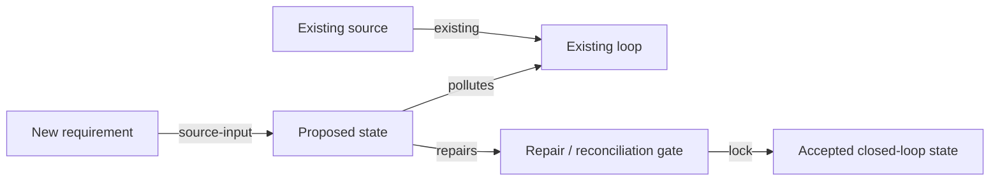

# Closed-Loop Requirement Drift Review

Use this skill to review proposed requirements against an implemented closed-loop audit baseline. The goal is to prevent new requirements from polluting existing loops, and to identify how the requirement should preserve or repair audited loop debt instead of adding another parallel path.

This is a companion skill, not an independent review. First use `legacy-system-archaeology` to establish implemented facts, then `implemented-closed-loop-audit` to score the current closed-loop design. Use this skill only after that audit baseline exists.

If no implemented closed-loop audit exists, do not proceed as a standalone PRD review. First run `implemented-closed-loop-audit` or ask for its output.

## Evidence Boundary

Allowed inputs:

- `implemented-closed-loop-audit` output as the baseline, especially source fact ledger, four-principle scorecard, implemented loop trace, drift audit, cross-check audit, identity/permission/approval continuity, debt ledger, and unknowns
- `legacy-system-archaeology` output only as supporting evidence for implemented facts, not as the direct drift baseline
- PRD, requirement note, user story, meeting notes, workflow proposal
- target-state diagrams, field lists, screenshots, acceptance criteria
- existing implementation facts only when explicitly labeled `Existing baseline`

Do not claim a proposed behavior is implemented. Use these tags:

- `Requirement`: stated by the PRD or user
- `Existing baseline`: current-system fact imported from the implemented closed-loop audit output
- `Inferred risk`: likely drift or failure mode from the proposed design
- `Unknown`: unanswered question requiring product, data, security, or ops decision
- `Repair recommendation`: design constraint or change needed to preserve or restore the closed loop

## Required Outputs

Always produce:

0. `Reader Summary`
1. `Implemented Closed-Loop Audit Imported`
2. `Requirement Boundary`
3. `Existing Loop Preservation / Repair Scorecard`
4. `Source-of-Truth Impact Map`
5. `Loop Pollution and Drift Ledger`
6. `Closed-Loop Before / After Flow`
7. `Repair Plan and Acceptance Gates`
8. `Blocking Questions`
9. `Compliance Checklist`

## Artifact Delivery

For full requirement drift reviews, write the complete output to a Markdown file in the target project's docs/report area. Do not paste the full report into chat unless the user explicitly asks for inline output.

The report must start with a localized `Reader Summary` before detailed drift tables. Use the user's current conversation language unless the user explicitly requests another language. Do not default to English just because the baseline, PRD, code, or template headings are English.

The final chat response should include only:

- the report file link
- a one-sentence decision: proceed, proceed with required repairs, redesign, or blocked by unknowns
- 3 to 5 reader-facing bullets covering the top closed-loop pollution risk, what the requirement can repair, release-blocking acceptance gates, and the most important blocking questions
- verification performed
- remaining blocking questions

Do not make the final response a count of sections, rows, or commands. Counts may appear only as supporting verification after the practical decision is clear.

## Reader Summary Standard

For full reviews, put `Reader Summary` at the top of the report unless scope/evidence metadata must appear first.

The summary must be understandable without reading the detailed drift ledger. Include:

- `Decision`: proceed, proceed with required repairs, redesign, or blocked by unknowns
- `Top pollution risk`: the most likely way the requirement could create duplicate truth or break an existing loop
- `Repair opportunity`: which existing broken or partial loop the requirement can improve
- `Non-negotiable gates`: the few acceptance gates that must pass before release
- `Blocking questions`: the unanswered decisions that materially affect source of truth, identity, permission, approval, reporting, workflow, or operations

Translate section labels into the user's language when helpful, but keep exact status values and evidence tags unchanged.

## Depth Gate

A full drift review must be decision-grade, not a chat summary with section headings. Before finalizing the Markdown artifact, verify that it includes enough detail for another agent to implement or reject the requirement without rerunning the review.

Minimum content for non-trivial requirements:

- at least 5 imported audit baseline rows, or every relevant baseline row if fewer exist
- at least 6 requirement-boundary rows covering actors, surfaces, objects, fields, writes/imports/exports, approvals, notifications, and explicit out-of-scope items as applicable
- all four principles scored with a concrete baseline state, requirement effect, status, and required repair
- at least 8 source-of-truth impact rows for data-heavy/accounting/audit/reporting requirements, or every affected business fact if fewer exist
- at least 8 drift-ledger rows spanning data, identity, permission, approval, report, workflow, and ops risks as applicable
- at least one Mermaid before/after diagram with typed edges and visible pollution/repair points
- at least 6 acceptance gates with evidence/test expectations and release-blocking status
- blocking questions separated from recommendations; do not hide unknowns inside prose

If the available evidence cannot support these counts, state `insufficient evidence` in the compliance checklist, list exactly what evidence is missing, and keep the report in Markdown. Do not replace the report with a short chat answer.

## Workflow

### 0. Import the implemented closed-loop audit baseline

Before reading the new requirement deeply, extract from the `implemented-closed-loop-audit` output:

- compliant, partial, broken, and Unknown loops
- canonical source facts and source row keys
- reused downstream modules
- duplicate-entry and drift risks already present
- current cross-check and reconciliation results
- identity anchors and migration risks
- permission, data-scope, approval, and workflow topology
- existing unknowns that must not be hidden by the new requirement

This baseline is the reference point. The requirement is judged by how it affects this baseline.

### 1. Fix the requirement boundary

State:

- requirement name and scope
- actors and surfaces
- objects affected
- data fields affected
- proposed writes, imports, exports, reports, approvals, and notifications
- what is explicitly out of scope

### 2. Score preservation or repair of the sixteen-character principle

Evaluate each principle against the existing baseline, not in isolation:

- `就源输入`: does the requirement reuse the existing authoritative source, create a new canonical source, or introduce duplicate/manual entry?
- `多次应用`: does it reuse existing facts and source row keys, or create copied facts that downstream modules will treat as truth?
- `环环相扣`: does it connect into the existing state chain, or create a side path that skips governed inputs and outputs?
- `相互稽核`: does it add reconciliation against existing independent surfaces, or weaken existing checks?

Use status values:

- `preserves`
- `repairs`
- `pollutes`
- `fragile`
- `Unknown`

### 3. Build the source-of-truth impact map

For each proposed business fact, identify:

- existing canonical owner
- proposed first capture/import surface
- whether the proposed fact reuses, supersedes, shadows, or duplicates existing state
- stable key
- derived/copy targets
- who may edit it
- which reports, exports, workflow tasks, and approvals reuse it
- what checks reconcile it

If the proposal lacks a canonical owner or stable key, mark it as a requirement defect. If it duplicates an existing source fact, mark it as closed-loop pollution unless the requirement includes a repair/cutover plan.

### 4. Build the loop pollution and drift ledger

Classify likely drift:

- `data-drift`: same fact can diverge across tables, files, reports, or spreadsheets
- `semantic-drift`: same field name has different meanings across modules
- `identity-drift`: stable id, runtime id, display code, and external id are mixed
- `permission-drift`: visibility or edit rights follow the wrong object/container after movement
- `approval-drift`: reviewer, task, signature, or approval history no longer follows the business object
- `report-drift`: exported/report totals cannot be traced back to source rows
- `workflow-drift`: state machine skips gates, allows stale actions, or loses rollback/retry semantics
- `ops-drift`: timers, queues, notifications, remote actions, or audit logs are not governed

Each drift row must include severity, baseline loop affected, trigger condition, affected object, likely symptom, and required repair.

### 5. Draw before / after closed-loop flow

Use Mermaid when supported. Edges must be labeled:

- `existing`
- `source-input`
- `reuse`
- `derive`
- `mutate`
- `approve`
- `export`
- `reconcile`
- `lock`
- `notify`
- `manual-risk`
- `pollutes`
- `repairs`

If the proposal does not define a link, use a dashed edge labeled `Unknown` or omit it and list the gap.

Show both:

- existing baseline path from archaeology
- proposed new path and where it preserves, pollutes, or repairs the baseline

### 6. Define repair plan and acceptance gates

Acceptance must prove the requirement will not create uncontrolled drift and will repair targeted broken loops. Include gates for:

- source capture
- duplicate-entry prevention
- source-row traceability
- permission/approval route
- report/export reconciliation
- stale data handling
- audit log
- rollback or supersede behavior
- operational notification/cooldown if the feature notifies users or changes remote state

### 7. Keep baseline and proposal separate

Do not rewrite the archaeology or implemented audit report inside this skill. Cite baseline facts as `Existing baseline`, then evaluate requirement impact. Keep proposed facts tagged `Requirement`.

## Output Template

### Reader Summary

- Decision:
- Top pollution risk:
- Repair opportunity:
- Non-negotiable gates:
- Blocking questions:

### Implemented Closed-Loop Audit Imported

| Baseline item | Current audit status | Evidence from implemented audit | Impact relevance |
|---|---|---|---|

### Requirement Boundary

| Item | Value | Tag |
|---|---|---|

### Existing Loop Preservation / Repair Scorecard

| Principle | Baseline state | Requirement effect | Status | Required repair | Evidence/tag |
|---|---|---|---|---|

### Source-of-Truth Impact Map

| Business fact | Existing canonical owner | Proposed input/change | Effect on source of truth | Stable key | Reused by | Reconciliation check | Required repair |
|---|---|---|---|---|---|---|---|

### Loop Pollution and Drift Ledger

| Drift type | Severity | Baseline loop affected | Trigger condition | Symptom | Required repair | Tag |
|---|---|---|---|---|---|---|

### Closed-Loop Before / After Flow

### Repair Plan and Acceptance Gates

| Gate | Baseline risk repaired | What must be proven | Test/evidence | Blocks release if failed? |
|---|---|---|---|---|

### Blocking Questions

- Unknowns that must be answered before design or implementation.

### Compliance Checklist

| Requirement | Status | Notes |
|---|---|---|
| Localized Reader Summary present and reflected in final chat response |  |  |
| Implemented closed-loop audit baseline imported |  |  |
| Requirement boundary defined |  |  |
| Four principles scored against baseline |  |  |
| Source-of-truth impact map complete |  |  |
| Drift ledger includes data/identity/permission/approval/report/workflow risks as applicable |  |  |
| Before/after Mermaid flow has typed edges |  |  |
| Repair gates preserve or restore closed-loop behavior |  |  |
| Current implementation facts are labeled Existing baseline |  |  |
| Depth gate satisfied or evidence gap explicitly stated |  |  |
