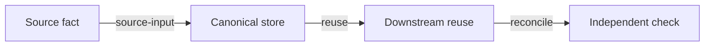

# Implemented Closed-Loop Audit

Use this skill to audit whether implemented code already satisfies the sixteen-character principle:

`就源输入、多次应用、环环相扣、相互稽核`

This is the second step in a three-skill workflow:

1. `legacy-system-archaeology`: factual archaeology of implemented code only
2. `implemented-closed-loop-audit`: audit implemented code against the sixteen-character principle
3. `closed-loop-requirement-drift`: evaluate a specific new requirement against the implemented audit baseline

Do not use this skill for PRDs, proposed screens, desired workflows, or future acceptance criteria. If no archaeology baseline exists, first run `legacy-system-archaeology` or ask for its output.

## Evidence Boundary

Allowed inputs:

- `legacy-system-archaeology` report, especially Evidence Sources, Data Logic Map, State and Dependency Map, Operational Ontology, Identity, Authorization, Technical Debt, and Unknowns
- implemented source code, migrations, tests, runtime snapshots, logs, scripts, and checked-in configuration used to verify disputed baseline facts

Forbidden inputs as implementation evidence:

- PRDs, roadmap items, backlog wishes, target-state diagrams, future requirements, stakeholder wishes
- a new requirement file; use `closed-loop-requirement-drift` for that

Use only these tags:

- `Observed`: directly supported by implemented artifacts
- `Inferred`: likely from evidence but not directly proven
- `Unknown`: not proven or contradictory

## Required Outputs

Always produce:

0. `Reader Summary`
1. `Imported Archaeology Baseline`
2. `Source Fact Ledger`
3. `Four-Principle Scorecard`
4. `Implemented Loop Trace`
5. `Duplicate Entry and Drift Audit`
6. `Cross-Check and Reconciliation Audit`
7. `Identity / Permission / Approval Continuity`
8. `Closed-Loop Debt Ledger`
9. `Unknowns That Block a Strong Audit Conclusion`
10. `Skill Compliance Checklist`

## Artifact Delivery

For full audits, write the complete output to a Markdown file in the target project's docs/report area. Do not paste the full audit into chat unless the user explicitly asks for inline output.

The audit file must start with a localized `Reader Summary` before detailed audit tables. Use the user's current conversation language unless the user explicitly requests another language. Do not default to English just because the imported baseline, code, or template headings are English.

The final chat response must use the same language as the user and include only:

- the audit file link
- a one-sentence closed-loop audit conclusion
- 3 to 5 reader-facing bullets covering the strongest compliant loop, the most broken or fragile loop, the highest-impact duplicate-entry or reconciliation risk, and the most important unknowns
- verification performed
- remaining blockers

Do not make the final response a count of sections, rows, or commands. Counts may appear only as supporting verification after the practical conclusion is clear.

## Reader Summary Standard

For full audits, put `Reader Summary` at the top of the report unless scope/evidence metadata must appear first.

The summary must be understandable without reading the detailed ledgers. Include:

- `One-sentence conclusion`: whether the implemented system is compliant, partial, broken, or still blocked by evidence
- `Strongest closed loop`: the best implemented evidence of `就源输入、多次应用、环环相扣、相互稽核`
- `Most important break`: where duplicate truth, lost traceability, weak handoff, or missing reconciliation matters most
- `Audit debt`: the top debt items that later requirement work must not hide
- `Unknowns`: the few unresolved facts that could change the audit conclusion

Translate section labels into the user's language when helpful, but keep exact score values and evidence tags unchanged.

## Audit Rules

- Keep current implementation separate from desired behavior. Do not say "should" unless it is in a debt row or unknown-resolution note.
- Do not create work-package plans, rollout sequences, repair plans, or acceptance gates. Those belong to planning or requirement-drift review.
- Do not score a loop as healthy unless source capture, downstream reuse, chain continuity, and independent check are all backed by artifacts.
- If an audit point depends on runtime data not inspected, mark it `Unknown`; do not infer compliance from naming.
- If the archaeology baseline lacks required data logic artifacts, state `insufficient baseline` and list what must be re-run in archaeology.

## Principle Definitions

- `就源输入`: the business fact is captured at its authoritative source or imported once with a stable source row key; uncontrolled manual recapture is absent or explicitly isolated.
- `多次应用`: downstream calculations, reports, workflows, exports, and reviews reuse the same source fact/key rather than copying a new truth.
- `环环相扣`: each step's governed output becomes the next step's governed input, with state transitions, retry/failure semantics, and traceable handoff.
- `相互稽核`: at least two independent surfaces reconcile the same fact before acceptance, posting, locking, reporting, or external notification.

Use score values:

- `compliant`: strong implemented evidence satisfies the principle
- `partial`: some chain exists but evidence, automation, or reconciliation is incomplete
- `broken`: implemented behavior allows uncontrolled duplicate truth, lost traceability, skipped gates, or unverifiable output
- `Unknown`: evidence is missing

## Workflow

### 1. Import the archaeology baseline

Extract:

- canonical business facts and source row keys
- source-entry modules and mutation surfaces
- downstream reuse surfaces
- manual correction or duplicate-entry surfaces
- report/export/workflow/notification outputs
- identity anchors and movement semantics
- permission, approval, data-scope, and runtime-task layers
- unknowns from the archaeology report

### 2. Build source fact ledger

For each important fact, capture:

- first entry/import surface
- canonical store
- stable source key
- allowed mutation surfaces
- copied/derived stores
- reports/exports/workflows that reuse it
- independent check surfaces
- evidence tag

### 3. Score the four principles

Score each principle per fact or loop. Do not average away a broken core fact. When one business fact has mixed behavior, split rows by flow.

### 4. Trace implemented loops

Use Mermaid with typed edges. Allowed labels:

- `source-input`
- `reuse`
- `derive`
- `mutate`
- `approve`
- `export`
- `reconcile`
- `lock`
- `notify`
- `manual-risk`
- `Unknown`
- `Inferred <type>`

Every edge must be labeled. Omit speculative edges.

### 5. Audit duplicate entry and drift

Classify current implemented drift:

- `data-drift`
- `semantic-drift`
- `identity-drift`
- `permission-drift`
- `approval-drift`
- `report-drift`
- `workflow-drift`
- `ops-drift`

Each row must include current implemented evidence, likely symptom, current guard if any, and audit status.

### 6. Audit cross-checks

For each report, export, workflow state, external notification, or locked/accounting state, identify what independent source can reconcile it. If none is implemented, mark the audit result `broken` or `Unknown`.

## Output Template

### Reader Summary

- One-sentence conclusion:
- Strongest closed loop:
- Most important break:
- Audit debt:
- Unknowns:

### Imported Archaeology Baseline

| Baseline item | Imported fact | Evidence | Tag |
|---|---|---|---|

### Source Fact Ledger

| Business fact | Source entry | Canonical store | Stable source key | Mutations | Reused by | Cross-check surface | Tag |
|---|---|---|---|---|---|---|---|

### Four-Principle Scorecard

| Fact / loop | 就源输入 | 多次应用 | 环环相扣 | 相互稽核 | Overall | Evidence |
|---|---|---|---|---|---|---|

### Implemented Loop Trace

### Duplicate Entry and Drift Audit

| Drift type | Fact / loop | Current implemented evidence | Symptom | Current guard | Audit status | Tag |
|---|---|---|---|---|---|---|

### Cross-Check and Reconciliation Audit

| Output / state | Source fact reconciled | Independent check | Automated or manual | Result | Evidence |
|---|---|---|---|---|---|

### Identity / Permission / Approval Continuity

| Object / flow | Stable identity | Permission/data scope follows? | Approval/history follows? | Continuity result | Evidence |
|---|---|---|---|---|---|

### Closed-Loop Debt Ledger

| Severity | Debt | Principle affected | Implemented evidence | Why it matters |
|---|---|---|---|---|

### Unknowns That Block a Strong Audit Conclusion

| Unknown | Blocks which principle | How to verify |
|---|---|---|

### Skill Compliance Checklist

| Requirement | Status | Notes |
|---|---|---|
| Localized Reader Summary present and reflected in final chat response |  |  |
| Archaeology baseline imported |  |  |
| No PRD/future requirement treated as implementation |  |  |
| Source fact ledger present |  |  |
| Four principles scored with allowed score values |  |  |
| Mermaid loop trace has typed edges |  |  |
| Drift audit covers applicable drift types |  |  |
| Cross-check/reconciliation audit present |  |  |
| Identity/permission/approval continuity audited where applicable |  |  |
| Unknowns separated from debt |  |  |
