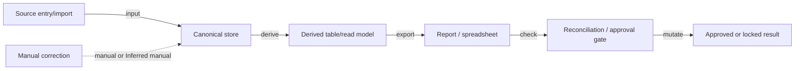

# Suggested Output Template

Use this shape when the user asks for a full legacy-system archaeology report from implemented artifacts. Do not include work-package plans, migration plans, replacement sequencing, rollout plans, or repair plans in this pure archaeology template.

## Scope Firewall

State the implemented evidence boundary. PRDs, roadmaps, backlog items, and desired future behavior are out of scope for this report unless they describe current production behavior.

## Evidence Sources

| Source | Evidence used | Included / excluded | Notes |
|---|---|---|---|

## Reader Summary

Write this section in the user's current conversation language unless the user explicitly requests another language. It must let a reader understand the practical conclusion before reading detailed tables.

- `One-sentence conclusion`:
- `What is proven`:
- `Main risks / unknowns`:
- `What this report does not judge`:
- `Next recommended review`:

## System Inventory

| Surface | Component | Role | Evidence | Confidence |
|---|---|---|---|---|

## Entry Points and Triggers

| Type | Entry point | Starts what | Evidence | Confidence |
|---|---|---|---|---|

Types usually include `web`, `cli`, `worker`, `timer`, `queue`, `script`, `webhook`.

## Core Flows

For each flow:

### Flow: `<name>`

- `Observed / Inferred / Unknown`
- Trigger:
- Main path:
- State touched:
- Side effects:
- Failure handling:
- Evidence:
- Gaps:

## State and Dependency Map

| Asset | Owned by | Read by | Written by | Coupling risk | Evidence |
|---|---|---|---|---|---|

Assets include tables, files, caches, buckets, queues, secrets, or remote systems.

## Risk Ledger

| Severity | Risk | Why it matters | Affected scope | Evidence | Operational / change impact |
|---|---|---|---|---|---|

## Operational Ontology Draft

| Object | Role | Canonical ID | Core properties | Key links | System of record | Confidence |
|---|---|---|---|---|---|---|

Then add:

- `State transitions`
- `Actions`
- `Legacy duplicates / semantic conflicts`
- `Stable ids vs stage ids vs display codes`

## Data Logic Map

Use this section for data-heavy, accounting-like, audit-like, report-driven, or reconciliation-heavy systems.

### Data fact ledger

| Business fact | First entry / import module | Canonical store | Source row key | Derived / copied stores | Manual entry or correction surfaces | Evidence |
|---|---|---|---|---|---|---|

### Module I/O matrix

| Module / surface | Inputs read | Writes / mutations | Derived outputs | Reports / exports | Reconciliation checks | Evidence |
|---|---|---|---|---|---|---|

### Duplicate-entry and drift matrix

| Business fact | Entry surface A | Entry surface B / copy | Same key? | Drift risk | Cross-check available? | Existing guard / missing check | Evidence |
|---|---|---|---|---|---|---|---|

### Data flow graph

Prefer Mermaid when supported. Keep node labels short and evidence-backed. Every evidence-bearing edge must be typed.

Every edge must be labeled with `input`, `derive`, `mutate`, `export`, `check`, `manual`, or `Inferred <edge-type>`.

## Identity and Movement Integrity

Use this section when objects can move, merge, split, clone, archive, or be re-parented.

### Move semantics

| Object | Move operation | Stable ID | Regenerated ID | Parent/container field | History table/log | Confidence |
|---|---|---|---|---|---|---|

### Downstream impact matrix

| Object permanent ID | Old container/code | New container/code | Domain checked | Query key used there | Status | Duplicate risk | Loss risk | Evidence |
|---|---|---|---|---|---|---|---|---|

Use status values:

- `migrated`
- `not migrated`
- `duplicated`
- `lost`
- `not applicable`
- `Unknown`

Then add:

- `Identity breaks found in current movement/copy/re-parent behavior`
- `Domains still keyed by stage or display code`

## Authorization and Approval Topology

Use this section when the system has roles, data-scope permissions, org routing, workflow approvals, or task assignment.

### Access layers

| Layer | Purpose | Primary tables/files | Key identifiers | Drift risk after object movement | Evidence |
|---|---|---|---|---|---|

Typical layers:

- `rbac`
- `data-scope`
- `org-binding`
- `workflow-template`
- `approval-config`
- `runtime-task`
- `message/signature`

### Approval routing map

| Business flow | Process/template | Assignment mechanism | Decision mechanism | Config source | Runtime evidence | Confidence |
|---|---|---|---|---|---|---|

### Movement impact on visibility and approval

| Movable object | Who can see before | Who can see after | Who approves before | Who approves after | Rebind required? | Evidence |
|---|---|---|---|---|---|---|

Then add:

- `Approval and visibility breaks found in current movement/copy/re-parent behavior`
- `Configs that are parent/container-bound and must be copied, rebuilt, or re-bound when objects move`

## Technical Debt and Unknowns

| Business fact / flow | Source captured where? | Reused by | Cross-check surfaces | Traceability state | Technical debt / unknown | Evidence |
|---|---|---|---|---|---|---|

Then add:

- `Traceability gaps found in current implemented behavior`
- `Technical debt that is structural, not merely framework age`

## Unknowns That Need Direct Verification

- runtime-only behaviors
- undocumented operator steps
- missing secrets or credentials
- host-specific jobs not present in repo
- do not list unimplemented future requirements here; route those to `closed-loop-requirement-drift`

## Skill Compliance Checklist

| Requirement | Status | Evidence / notes |
|---|---|---|
| Scope Firewall and Evidence Sources present |  |  |
| Localized Reader Summary present and reflected in final chat response |  |  |
| Base sections 1-7 present |  |  |
| Data Logic Map present when data/audit/reporting matters |  |  |
| Data fact ledger present |  |  |
| Module I/O matrix present |  |  |
| Duplicate-entry and drift matrix present |  |  |
| Every evidence-bearing Mermaid graph has typed edges |  |  |
| Identity impact matrix present when identity/movement matters |  |  |
| Authorization/access topology present when permissions/approvals matter |  |  |
| Work-package/replacement/repair planning omitted |  |  |
| Claims tagged Observed/Inferred/Unknown |  |  |
| Unknowns needing direct verification listed |  |  |
| Future/PRD requirements excluded from archaeology findings |  |  |
| Section numbering is contiguous or omitted |  |  |
| Report depth gate satisfied or insufficient evidence explained |  |  |
